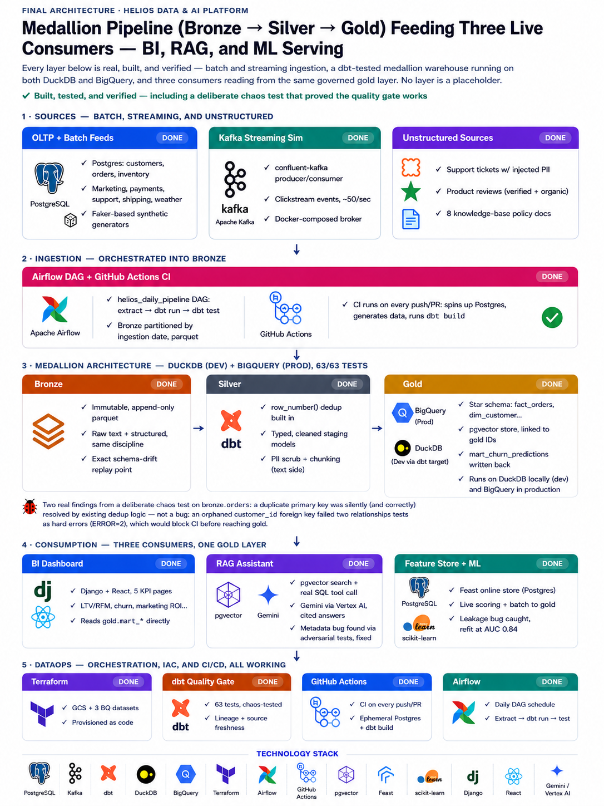
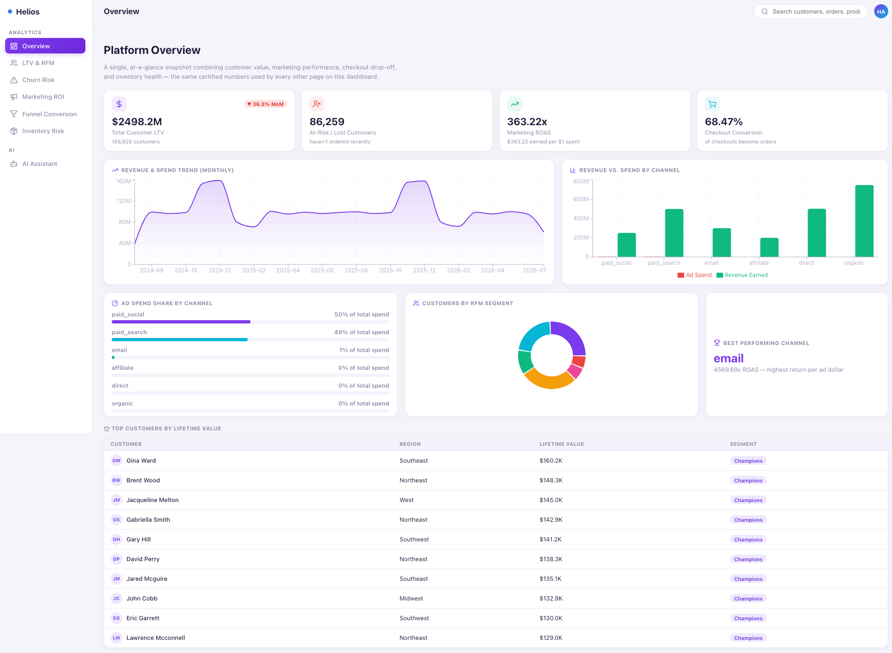
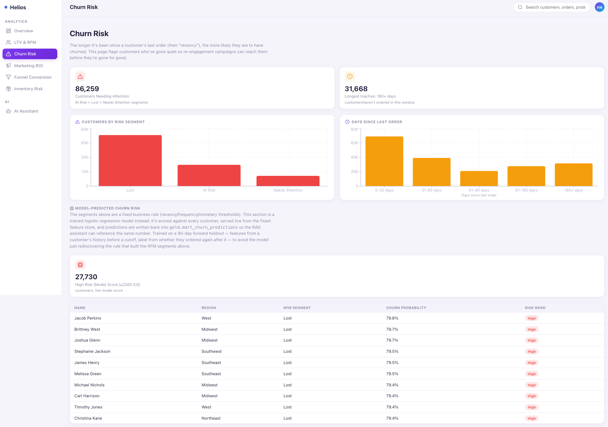
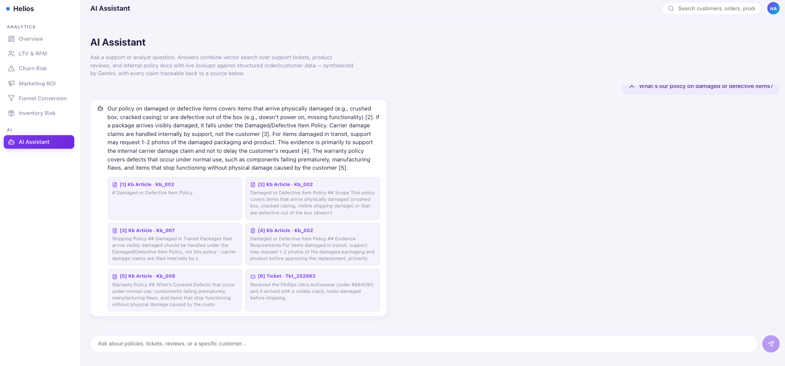

# Helios: Unified Real-Time Data & AI Platform

A capstone data engineering + AI platform built around a fictional e-commerce
business, NorthStar Retail. It ties together everything a modern "data platform"
job posting actually means when it lists Kafka, dbt, Airflow, CI/CD, and
"AI-ready data" in the same requisition: a governed medallion pipeline (bronze →
silver → gold) that serves three different consumers from the same certified
gold layer — a BI dashboard, a hybrid-retrieval RAG assistant, and a real-time
ML feature/scoring API — rather than three teams maintaining three disconnected
copies of "what is an order."

## Architecture



## Screenshots







## Business scenario

NorthStar Retail sells online. Its data includes orders, customers, products,
inventory, marketing spend across three channels, payments, shipments, weather,
clickstream, and — because a real platform also has unstructured data — support
tickets, product reviews, and an internal knowledge base of policies. Three
consumption needs exist side by side:

- **Leadership/ops** need live dashboards: lifetime value & RFM segmentation,
  churn risk, marketing ROI/CAC, funnel conversion, inventory risk.
- **Support agents/analysts** need an assistant that can answer "why is this
  customer unhappy" or "does this order qualify for a refund under our policy,"
  grounded in real ticket/review/policy text with citations, not keyword search.
- **The churn model** needs low-latency, always-fresh features rather than a
  weekly CSV export, and its predictions need to land somewhere the dashboard
  and assistant can both read.

## Tech stack

Python (Faker-based synthetic data generation), Postgres (OLTP + Feast online
store + pgvector), Kafka via `confluent-kafka` (clickstream streaming
simulation), dbt-core with both `dbt-duckdb` (local dev) and `dbt-bigquery`
(cloud) adapters sharing one model set, Google Cloud (GCS + BigQuery + Vertex
AI), Terraform, GitHub Actions, Airflow, `sentence-transformers` for local
embeddings, pgvector for the vector store, Feast for feature serving,
scikit-learn for the churn model, Django + Django REST Framework + React
(Vite, Recharts) for the unified BI/RAG web app, and Gemini via the
`google-genai` SDK (Vertex AI backend) for RAG generation.

## Project folder structure

```text
helios-platform/
├── .env                                  - local secrets: Postgres creds, GCP project ID (not committed)
├── .gitignore
├── README.md
├── requirements.txt                      - single shared Python env for the whole platform
│
├── attachments/                          - screenshots referenced in this README
│   ├── architecture.png
│   ├── analytics1.png
│   ├── ml_analytics2.png
│   └── ai_assistant.png
│
├── docs/
│   └── phase9_dataops_hardening.md       - lineage, chaos test findings, freshness, real cost numbers
│
├── database/
│   └── 01_schema.sql                     - Postgres OLTP DDL (customers, products, orders, inventory...)
│
├── data_generator/                       - Faker-based synthetic NorthStar Retail data
│   ├── db.py
│   ├── generate_dimensions.py            - customers, products (run first — everything depends on this)
│   ├── generate_orders.py
│   ├── generate_inventory.py
│   ├── generate_marketing.py             - Google/Meta/email campaign spend
│   ├── generate_payments.py
│   ├── generate_support_tickets.py       - ~4% of ticket descriptions carry injected PII (for the PII-scrub demo)
│   ├── generate_shipments.py
│   └── generate_reviews.py               - verified (tied to real orders) + organic reviews
│
├── external_feeds/                       - simulated external API/CSV drops (what ingestion/ reads from)
│   ├── marketing/   (google_ads_daily.csv, meta_ads_daily.csv, email_campaign_sends.csv)
│   ├── payments/    (stripe_payments.csv)
│   ├── shipping/    (carrier_shipments.csv)
│   ├── support/     (support_tickets.csv)
│   └── reviews/     (product_reviews.csv)
│
├── knowledge_base/                       - 8 hand-written policy docs (return/shipping/warranty/loyalty/
│                                            chargeback/price-match/damaged-item/international) — RAG grounding source
│
├── ingestion/                            - lands every source into bronze as parquet
│   ├── export_postgres_to_bronze.py      - batch export of OLTP tables (the CDC stand-in)
│   ├── ingest_marketing_feeds.py
│   ├── ingest_payments_feed.py
│   ├── ingest_support_feed.py
│   ├── ingest_shipping_feed.py
│   ├── ingest_weather_feed.py            - live weather API (excluded from CI, needs a key)
│   ├── ingest_reviews.py
│   └── ingest_knowledge_base.py
│
├── streaming_sim/                        - Kafka clickstream simulation
│   ├── docker-compose.yml                - single-broker Kafka (confluent images)
│   ├── producer.py                       - ~50 synthetic clickstream events/sec
│   └── consumer.py
│
├── lake/
│   └── bronze/                           - partitioned parquet, one folder per source, ingested_date=YYYY-MM-DD
│
├── warehouse/                            - dbt project: 36 models, 63 tests, 15 sources
│   ├── dbt_project.yml
│   ├── profiles.yml                      - "dev" (DuckDB) + "bigquery" (BigQuery prod) targets
│   ├── models/staging/                   - cleaned, deduplicated (row_number() dedup), typed
│   ├── models/marts/core/                - star schema: fact_orders, fact_order_items, dim_customer...
│   ├── models/marts/analytics/           - mart_customer_ltv_rfm, mart_marketing_roi, mart_churn_predictions...
│   ├── seeds/                            - channel_seed.csv, warehouse_seed.csv
│   └── macros/generate_schema_name.sql
│
├── ai_pipeline/                          - unstructured/AI layer
│   ├── pii_scrub.py                      - regex-based PII scrubbing before anything gets embedded
│   ├── chunk_kb.py                       - markdown chunking (splits on "## " headers)
│   ├── build_vector_store.py             - sentence-transformers (all-MiniLM-L6-v2) → pgvector
│   ├── verify_retrieval.py               - retrieval-quality spot check (known query → expected chunk)
│   └── tests/                            - test_pii_scrub.py, test_chunk_kb.py
│
├── feature_repo/                         - Feast feature store
│   ├── feature_store.yaml                - Postgres online store config
│   ├── definitions.py                    - customer Entity + customer_ltv_rfm_features FeatureView
│   └── data/customer_features.parquet    - offline source (current snapshot, feeds the online store)
│
├── ml/                                   - churn model training + serving
│   ├── export_features.py                - current-snapshot features → Feast's offline parquet source
│   ├── build_churn_training_set.py       - leakage-free forward-looking holdout (features before a
│   │                                        cutoff, label = ordered again after it)
│   ├── train_churn_model.py              - LogisticRegression pipeline, real AUC 0.84
│   ├── batch_score_churn.py              - scores every customer → gold.mart_churn_predictions
│   └── churn_model.joblib                - trained model artifact
│
├── orchestration/
│   ├── docker-compose.yml                - local Airflow (webserver + scheduler)
│   └── dags/helios_daily_pipeline.py     - extract (all sources) → dbt run → dbt test
│
├── infra/terraform/                      - GCS bucket + bronze/silver/gold BigQuery datasets
│   ├── main.tf
│   ├── variables.tf
│   └── versions.tf
│
├── .github/workflows/
│   └── ci.yml                            - CI: ephemeral Postgres, small synthetic dataset, dbt build
│                                            on every push/PR to main
│
└── webapp/                               - unified BI dashboard + RAG assistant + churn serving
    ├── backend/                          - Django + Django REST Framework
    │   ├── manage.py
    │   ├── helios_dashboard/             - settings.py, urls.py, bq_client.py
    │   ├── kpi/                          - 5 KPI endpoints (LTV/RFM, churn risk, marketing ROI,
    │   │                                    funnel conversion, inventory risk) — reads gold.mart_* directly
    │   ├── assistant/                    - RAG endpoint: pgvector search + lookup_customer_history
    │   │                                   SQL tool + Gemini synthesis (rag.py, views.py)
    │   └── churn/                        - live churn scoring: Feast online store + trained model
    │                                        (views.py: score_customer, top_risk)
    └── frontend/                         - React (Vite)
        └── src/
            ├── components/                - StatCard, LoadingState, ErrorState, per-KPI chart sections
            ├── pages/AssistantPage.jsx     - RAG chat UI with example questions + citations
            ├── layouts/AppLayout.jsx       - sidebar navigation shell
            └── chartTheme.js               - shared chart colors/formatters
```

## How to reproduce this project end to end

### Prerequisites

Python 3.12, PostgreSQL 16+ (pgvector-capable — see step 3), Node.js + npm,
Docker (for the Kafka simulation and local Airflow), the `gcloud` CLI with a
GCP project that has billing enabled (for BigQuery + Vertex AI), and Terraform.

### 1. Clone and set up the Python environment

```bash
git clone <this-repo-url> helios-platform && cd helios-platform
python3 -m venv .venv && source .venv/bin/activate
pip install -r requirements.txt
```

### 2. Configure environment variables

DB_HOST=localhost
DB_PORT=5432
DB_NAME=helios
DB_USER=helios_app
DB_PASSWORD=<your-local-postgres-password>
GCP_PROJECT_ID=<your-gcp-project-id>


Create a `.env` file in the repo root:


### 3. Set up Postgres (OLTP + Feast online store + pgvector)

```bash
createdb helios
psql -d helios -f database/01_schema.sql
psql -d helios -c "CREATE EXTENSION IF NOT EXISTS vector;"
```

If your Postgres build doesn't bundle pgvector, build it from source against
your `pg_config`:

```bash
git clone https://github.com/pgvector/pgvector.git && cd pgvector
make && make install
cd ..
```

Make sure the app role owns anything it needs to `TRUNCATE`/write to — a
superuser-created table blocking `helios_app` was one of the real issues hit
during this build:

```bash
psql -d helios -c "ALTER SCHEMA feast OWNER TO helios_app;"
```

### 4. Provision cloud infra (optional — only needed for the BigQuery/Vertex AI path)

```bash
cd infra/terraform
terraform init
terraform apply
cd ../..
```

This provisions a GCS bucket and three BigQuery datasets: `bronze`, `silver`, `gold`.

### 5. Generate synthetic NorthStar Retail data

Order matters — dimensions first, then everything that references
customers/products/orders:

```bash
cd data_generator
python generate_dimensions.py
python generate_orders.py
python generate_inventory.py
python generate_marketing.py
python generate_payments.py
python generate_support_tickets.py
python generate_shipments.py
python generate_reviews.py
cd ..
```

### 6. (Optional) Run the Kafka clickstream simulation

```bash
cd streaming_sim
docker compose up -d
python producer.py     # emits ~50 synthetic clickstream events/sec for 60 seconds
python consumer.py     # consumes and writes events out for ingestion
cd ..
```

### 7. Ingest everything into bronze (parquet)

```bash
python ingestion/export_postgres_to_bronze.py
python ingestion/ingest_marketing_feeds.py
python ingestion/ingest_payments_feed.py
python ingestion/ingest_support_feed.py
python ingestion/ingest_shipping_feed.py
python ingestion/ingest_weather_feed.py     # needs a live weather API key — skip if you don't have one
python ingestion/ingest_reviews.py
python ingestion/ingest_knowledge_base.py
```

### 8. Run the dbt medallion pipeline

Local development uses DuckDB by default (`target: dev` in `warehouse/profiles.yml`):

```bash
cd warehouse
dbt build
```

Switch to BigQuery once Terraform has provisioned the datasets and you've run
`gcloud auth application-default login`:

```bash
dbt build --target bigquery
```

Generate and browse lineage:

```bash
dbt docs generate
dbt docs serve --port 8180
```

Check source freshness:

```bash
dbt source freshness
```

### 9. Build the unstructured/AI pipeline (PII scrub → chunk → embed → pgvector)

```bash
cd ../ai_pipeline
python pii_scrub.py
python chunk_kb.py
python build_vector_store.py
python verify_retrieval.py
cd ..
```

### 10. Feature store + churn model

```bash
python ml/export_features.py
cd feature_repo
feast apply
feast materialize-incremental $(date -u +%Y-%m-%dT%H:%M:%S)
cd ..
python ml/build_churn_training_set.py
python ml/train_churn_model.py
python ml/batch_score_churn.py
```

### 11. Run the web app (BI dashboard + RAG assistant + churn serving)

Backend:

```bash
cd webapp/backend
python manage.py migrate
python manage.py runserver 8000
```

Frontend, in a separate terminal:

```bash
cd webapp/frontend
npm install
npm run dev
```

Open `http://localhost:5173`. The RAG assistant needs a Vertex AI-enabled GCP
project:

```bash
gcloud services enable aiplatform.googleapis.com
gcloud auth application-default login
```

No API key is required — Gemini is called as a first-party Vertex AI model.

### 12. Orchestration (optional)

```bash
cd orchestration
docker compose up -d
```

Trigger `helios_daily_pipeline` from the Airflow UI (`localhost:8080`), or run
the same steps ad hoc — it just chains the ingestion scripts + `dbt run` + `dbt test` above.

### 13. CI

Every push/PR to `main` runs `.github/workflows/ci.yml` automatically: spins
up an ephemeral Postgres, generates a small-scale synthetic dataset, ingests
to bronze, and runs `dbt build` (excluding the live-API weather source and the
Kafka-dependent clickstream models, since CI has neither).

### 14. (Optional) Reproduce the chaos test

Full walkthrough and exact commands in `docs/phase9_dataops_hardening.md` —
injecting a duplicate primary key and an orphaned foreign key into bronze
`orders` and watching `dbt build` correctly ignore one (existing dedup logic)
and hard-fail the other (a real `relationships` test catching a bad foreign key).

## The five BI questions (dashboard)

Lifetime value & RFM segmentation, churn risk (rule-based RFM segments *and* a
trained ML model side by side — see below), marketing ROI/CAC by channel,
funnel conversion (view → cart → checkout → purchase), and inventory risk
(stockout/overstock by warehouse). All five read directly from `gold.mart_*`
tables via a Django API layer — no separate copy of the business logic.

## The RAG assistant

Hybrid retrieval: a Postgres/pgvector similarity search over embedded support
tickets, product reviews, and knowledge-base articles, plus a genuine
tool-calling SQL lookup (`lookup_customer_history`) the model can invoke
against BigQuery gold tables. Gemini (via Vertex AI) synthesizes the answer and
cites sources. Verified against an adversarial test battery (edge cases,
multi-hop questions across several customers, "gotcha" questions designed to
expose whether the model would fabricate an answer) — that testing caught a
real bug (customer/order/product IDs weren't being passed into the model's
context, so it incorrectly claimed data it actually had access to was
unavailable) which was found and fixed.

## The churn model — and a leakage bug we caught and fixed

The first version of the churn classifier trained against a label derived from
`mart_customer_ltv_rfm.rfm_segment` (`churned = 1` if segment is "At Risk" or
"Lost"). That segment is built from `r_score`, an `ntile(5)` over
`recency_days` — and both qualifying segments require `r_score <= 2`. Since
`recency_days` was also a training feature, the model scored a suspicious 1.00
across precision/recall/f1/accuracy: it wasn't predicting churn, it was
rediscovering the threshold that defined churn.

Fixed by rebuilding the training set as a genuine forward-looking holdout
directly from `fact_orders` (`ml/build_churn_training_set.py`): features
computed from a customer's order history before a 90-day cutoff, label based
on whether they ordered again after it. Retrained, the model scored a
realistic AUC of 0.84 (78% accuracy, 0.64/0.59 precision/recall on the churn
class) — a legitimate result instead of a tautology. Every customer is now
batch-scored into `gold.mart_churn_predictions`, and a live endpoint
(`/api/churn/score/<id>/`) pulls features from Feast's online store and scores
them in real time for low-latency serving. Both paths are visible in the
Churn Risk dashboard tab.

## DataOps: what the pipeline actually catches

A deliberate chaos test was run against the `orders` bronze data to check
whether the quality gate is real or decorative (full details:
`docs/phase9_dataops_hardening.md`). Two things came out of it:

1. Injecting a duplicate primary key didn't trip any test — because
   `stg_orders.sql` already deduplicates via `row_number() over (partition by
   order_id order by updated_at desc)`. Not a bug: confirmation the silver
   layer's dedup logic works as designed.
2. Injecting an orphaned foreign key (an order pointing at a `customer_id`
   that doesn't exist in `dim_customer`) failed two `relationships` tests as
   hard errors — `dbt build` returned `ERROR=2`, which in the GitHub Actions
   CI pipeline would block the run before the bad row ever reached gold, the
   dashboard, or the RAG assistant. Reverting the file returned the build to
   a clean pass immediately.

Lineage is available via `dbt docs generate && dbt docs serve` (36 models, 63
tests, 15 sources). Source freshness is configured on `orders`
(`dbt source freshness`). Real BigQuery usage was pulled from
`INFORMATION_SCHEMA.JOBS_BY_PROJECT` rather than estimated: 835 query jobs,
22.35 GB billed, roughly $0.14 at on-demand pricing on the day this was built.
Embeddings run locally (zero API cost); Gemini via Vertex AI needed no manual
quota request, unlike the Claude-on-Vertex path that was tried first and
abandoned after hitting a hard zero-quota wall for partner models on a new
GCP project.

## Notable problems hit and how they were solved

- **BigQuery vs DuckDB SQL portability** — date/timestamp functions, and
  dbt's default `quote: true` on `accepted_values` tests (breaks on BigQuery's
  strict INT64 typing) — solved with ``
  branches and per-test `quote: false` overrides.
- **pgvector wouldn't build against the installed Postgres** — a stale
  `-isysroot` SDK path baked into Postgres's build flags after an Xcode CLT
  update; fixed with a one-line SDK symlink, then built pgvector from source.
- **Feast configuration errors** — deprecated `event_timestamp_column`
  (replaced with `timestamp_field`), a Postgres online store requiring
  `sslmode: disable`, and a table-ownership mismatch after a superuser-created
  table blocked `TRUNCATE ... RESTART IDENTITY` for the app role.
- **Claude-on-Vertex hit a hard quota wall** — partner/foundation models
  default to zero quota on a new GCP project and require a manual Console
  request; pivoted to Gemini (a first-party Vertex model with default quota)
  rather than wait on a quota increase.
- **The churn model's leakage bug** — detailed above; caught by noticing a
  suspicious perfect accuracy rather than treating it as a win.
- **The RAG assistant's missing-metadata bug** — found via a self-directed
  adversarial test battery, not routine testing; the model had access to
  customer/order/product IDs but they weren't being passed into its context,
  so it sometimes claimed not to have data it actually had.

## Scope: what's simplified vs. the original plan

This was scoped as an ambitious, multi-month capstone; a few deliberate
simplifications were made to ship a complete, working system in the time
available:

- Clickstream streaming is a bounded ~60-second Kafka producer/consumer
  simulation (`streaming_sim/`), not an always-on Flink/Dataflow job with
  watermarking over a live, continuous stream.
- CDC off the OLTP database is a direct batch export
  (`ingestion/export_postgres_to_bronze.py`), not a continuous Debezium/
  Datastream connector.
- Lineage uses dbt's built-in DAG (`dbt docs generate`) rather than a
  standalone OpenLineage/Data Catalog deployment.
- BI is a custom Django+React dashboard rather than Looker Studio/Power BI —
  a deliberate upgrade in some respects (it shares one React app with the RAG
  assistant) but a deviation from the original plan's tooling choice.
- Feast serves a single current-snapshot of features rather than true
  point-in-time historical feature versions; the churn *training* set,
  however, does use a genuine point-in-time holdout (see above) to keep the
  model itself honest even though the online-serving snapshot isn't
  time-travel-capable.
- Terraform provisions one environment, not a full dev → staging → prod
  triplet.

None of these are blockers to the platform functioning end-to-end; they're the
honest list of what a "properly done, multi-month version" would extend
further.
